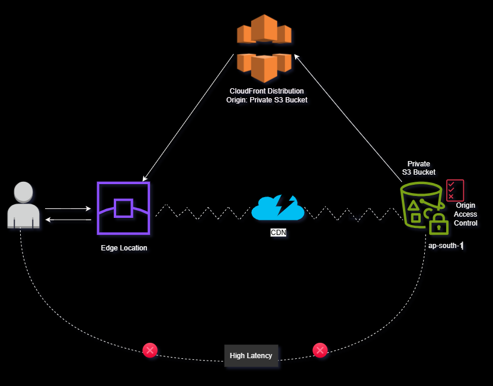

# Secure Static Website Hosting using AWS

This project demonstrates how to securely host a static website using AWS services.

## Services Used
- Amazon S3
- CloudFront
- Route 53
- IAM
- ACM

## Architecture

## Project Steps

1. Create S3 bucket
2. Upload static website files
3. Configure bucket policy
4. Create CloudFront distribution
5. Attach SSL certificate
6. Configure Route53 domain
7. Access website securely

## Security Features

- Private S3 bucket
- Access via CloudFront only
- HTTPS enabled
- IAM least privilege access

## Outcome

A secure and scalable static website hosted on AWS using S3 and CloudFront.
